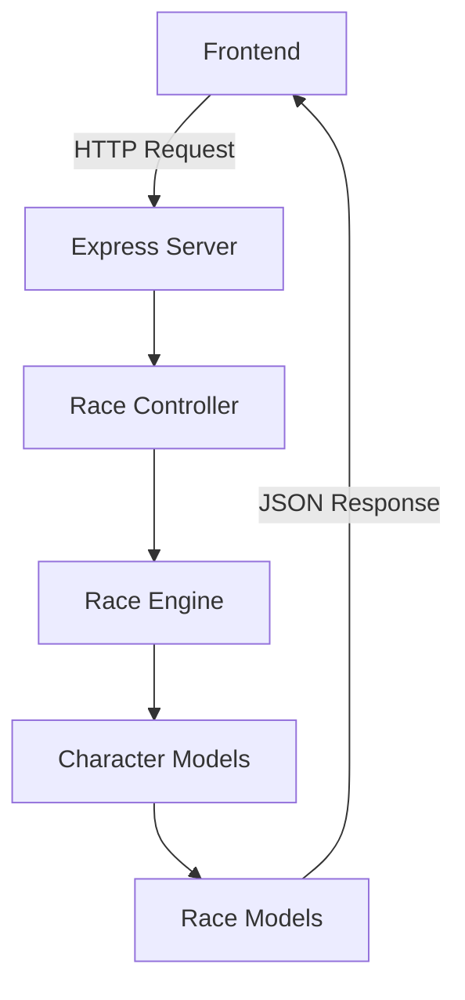

# 🏁 Mario Kart Racing Simulator

<div align="center">


[](https://github.com/LeonardoMendesXCIX/mario-kart-racing-simulator)
[](https://github.com/LeonardoMendesXCIX/mario-kart-racing-simulator)
[](https://opensource.org/licenses/MIT)

**🎮 Simulador de corrida interativo inspirado no clássico Mario Kart com interface web moderna e sistema de ranking em tempo real**

[🚀 Demo Online](#) • [📖 Documentação](#como-executar) • [🐛 Reportar Bug](https://github.com/LeonardoMendesXCIX/mario-kart-racing-simulator/issues)

</div>

---

## 📋 Tabela de Conteúdos

- [🎯 Sobre o Projeto](#-sobre-o-projeto)
- [✨ Funcionalidades](#-funcionalidades)
- [🛠️ Tecnologias Utilizadas](#️-tecnologias-utilizadas)
- [🚀 Como Executar](#-como-executar)
- [🎮 Como Jogar](#-como-jogar)
- [🏗️ Arquitetura](#️-arquitetura)
- [🆕 Melhorias Implementadas](#-melhorias-implementadas)
- [🔮 Evoluções Futuras](#-evoluções-futuras)
- [🤝 Contribuindo](#-contribuindo)
- [📄 Licença](#-licença)
- [👨‍💻 Autor](#-autor)

---

## 🎯 Sobre o Projeto

O **Mario Kart Racing Simulator** é um projeto educacional avançado desenvolvido como parte do desafio da **Digital Innovation One (DIO)**. Este simulador de corrida combina a nostalgia dos jogos clássicos do Mario Kart com tecnologias web modernas, oferecendo uma experiência interativa completa.

### 🎪 Demonstração Visual


*Interface principal do simulador em ação*

### 🎲 Mecânica do Jogo

O jogo utiliza um sistema baseado em dados e atributos dos personagens:

- **🏎️ RETA**: Velocidade + Dado (1-6)
- **🌀 CURVA**: Manobrabilidade + Dado (1-6)  
- **⚔️ CONFRONTO**: Poder + Dado (1-6) vs Oponente
- **✨ POWER-UPS**: Itens especiais que modificam atributos temporariamente

---

## ✨ Funcionalidades

### 🎮 Core Features
- ✅ **6 Personagens Únicos** com stats balanceados
- ✅ **5 Pistas Temáticas** com diferentes dificuldades
- ✅ **Sistema de Corrida em Tempo Real** com dados aleatórios
- ✅ **Power-ups Dinâmicos** (Cogumelo, Estrela, Raio)
- ✅ **Ranking ao Vivo** com atualização automática
- ✅ **Log Detalhado** de todas as ações da corrida

### 🌐 Interface Web
- ✅ **Design Responsivo** para desktop e mobile
- ✅ **Animações Suaves** e feedback visual
- ✅ **Seleção Interativa** de personagens e pistas
- ✅ **Modo Simulação Completa** para resultados instantâneos
- ✅ **Histórico de Corridas** persistente

### 🔧 Recursos Técnicos
- ✅ **API RESTful** completa com Express.js
- ✅ **Arquitetura MVC** bem estruturada
- ✅ **Sistema de Logs** detalhado
- ✅ **Tratamento de Erros** robusto
- ✅ **Código Modular** e reutilizável

---

## 🛠️ Tecnologias Utilizadas

### Backend
- **Node.js** - Runtime JavaScript
- **Express.js** - Framework web minimalista
- **CORS** - Controle de acesso entre origens
- **Helmet** - Middleware de segurança
- **Morgan** - Logger HTTP
- **Compression** - Compressão de respostas

### Frontend
- **HTML5** - Estrutura semântica
- **CSS3** - Estilização moderna com Grid/Flexbox
- **JavaScript ES6+** - Lógica interativa
- **Fetch API** - Comunicação com backend

### Ferramentas de Desenvolvimento
- **Nodemon** - Auto-reload durante desenvolvimento
- **ESLint** - Análise estática de código
- **Prettier** - Formatação automática

---

## 🚀 Como Executar

### 📋 Pré-requisitos

- **Node.js** (versão 16 ou superior)
- **npm** (versão 8 ou superior)
- **Git** para clonagem do repositório

### 🔧 Instalação

1. **Clone o repositório**
```bash
git clone https://github.com/LeonardoMendesXCIX/mario-kart-racing-simulator.git
cd mario-kart-racing-simulator
```

2. **Instale as dependências**
```bash
npm install
```

3. **Execute o projeto**
```bash
# Modo desenvolvimento (com auto-reload)
npm run dev

# Modo produção
npm start
```

4. **Acesse a aplicação**
```
🌐 Interface Web: http://localhost:3000
🔧 API Endpoints: http://localhost:3000/api
```

### 🧪 Scripts Disponíveis

```bash
npm start          # Inicia o servidor em produção
npm run dev        # Inicia em modo desenvolvimento
npm test           # Executa testes unitários
npm run lint       # Verifica qualidade do código
npm run format     # Formata código automaticamente
npm run setup      # Configuração inicial completa
```

---

## 🎮 Como Jogar

### 1️⃣ **Seleção de Personagens**
- Escolha de 2 a 6 personagens
- Cada personagem tem stats únicos:
  - 🍄 **Mario**: Equilibrado (4/3/3)
  - 👻 **Luigi**: Técnico (3/4/4)
  - 👑 **Peach**: Elegante (3/4/2)
  - 🦕 **Yoshi**: Ágil (2/4/3)
  - 🐢 **Bowser**: Poderoso (5/2/5)
  - 🦍 **Donkey Kong**: Forte (2/2/5)

### 2️⃣ **Escolha da Pista**
- **🏁 Circuito do Mario**: Pista para iniciantes
- **🌈 Estrada Arco-Íris**: Desafio máximo no espaço
- **🏰 Castelo do Bowser**: Pista sombria com armadilhas
- **🌴 Selva Tropical**: Muitas curvas na natureza
- **❄️ Circuito Gelado**: Pista escorregadia

### 3️⃣ **Modos de Jogo**
- **🎲 Rodada por Rodada**: Controle total da corrida
- **⚡ Simulação Completa**: Resultado instantâneo

---

## 🏗️ Arquitetura

```
mario-kart-racing-simulator/
├── 📁 src/
│   ├── 📁 controllers/     # Lógica de negócio
│   ├── 📁 models/         # Modelos de dados
│   ├── 📁 services/       # Serviços e utilitários
│   ├── 📁 config/         # Configurações JSON
│   └── 📄 app.js          # Servidor principal
├── 📁 public/
│   ├── 📁 css/           # Estilos responsivos
│   ├── 📁 js/            # JavaScript frontend
│   └── 📄 index.html     # Interface principal
├── 📁 data/              # Dados persistentes
├── 📁 docs/              # Documentação
├── 📁 tests/             # Testes unitários
└── 📄 package.json       # Configurações do projeto
```

### 🔄 Fluxo de Dados



---

## 🆕 Melhorias Implementadas

### 🚀 **Em relação ao projeto original:**

| Funcionalidade | Original | Melhorado |
|---|---|---|
| **Interface** | ❌ Terminal apenas | ✅ Interface web moderna |
| **Interatividade** | ❌ Execução linear | ✅ Controle total pelo usuário |
| **Visualização** | ❌ Texto simples | ✅ Design responsivo com animações |
| **Persistência** | ❌ Sem histórico | ✅ Histórico de corridas |
| **API** | ❌ Não disponível | ✅ API RESTful completa |
| **Power-ups** | ❌ Não implementado | ✅ Sistema de itens especiais |
| **Ranking** | ❌ Resultado final apenas | ✅ Ranking em tempo real |
| **Pistas** | ❌ Uma pista genérica | ✅ 5 pistas temáticas |
| **Logs** | ❌ Console básico | ✅ Log detalhado e visual |
| **Arquitetura** | ❌ Código monolítico | ✅ Arquitetura modular MVC |

### 🎯 **Inovações Técnicas:**
- **Sistema de Estados**: Gerenciamento completo do ciclo de vida das corridas
- **Engine de Corrida**: Motor robusto com lógica de negócio separada
- **API Design**: Endpoints RESTful seguindo boas práticas
- **Error Handling**: Tratamento abrangente de erros
- **Performance**: Otimizações de carregamento e responsividade

---

## 🔮 Evoluções Futuras

### 🎮 **Gameplay**
- [ ] **Modo Campeonato** com múltiplas corridas
- [ ] **Sistema de Conquistas** e badges
- [ ] **Multiplayer Online** em tempo real
- [ ] **IA Avançada** para oponentes
- [ ] **Editor de Pistas** personalizado

### 🛠️ **Técnicas**
- [ ] **Banco de Dados** (MongoDB/PostgreSQL)
- [ ] **Autenticação** de usuários
- [ ] **WebSockets** para tempo real
- [ ] **Docker** para containerização
- [ ] **Testes Automatizados** (Jest/Mocha)
- [ ] **CI/CD Pipeline** (GitHub Actions)

### 🌐 **Deploy**
- [ ] **Deploy na Vercel/Netlify**
- [ ] **API na Railway/Render**
- [ ] **CDN** para assets estáticos
- [ ] **Monitoramento** com logs avançados

---

## 🤝 Contribuindo

Contribuições são sempre bem-vindas! Veja como você pode ajudar:

### 🐛 **Reportando Bugs**
1. Verifique se o bug já foi reportado
2. Crie uma issue detalhada
3. Inclua steps para reproduzir
4. Adicione screenshots se necessário

### ✨ **Sugerindo Melhorias**
1. Fork o projeto
2. Crie uma branch para sua feature (`git checkout -b feature/AmazingFeature`)
3. Commit suas mudanças (`git commit -m 'Add some AmazingFeature'`)
4. Push para a branch (`git push origin feature/AmazingFeature`)
5. Abra um Pull Request

### 📝 **Padrões de Código**
- Use ESLint para manter consistência
- Documente funções complexas
- Mantenha commits pequenos e descritivos
- Teste suas alterações antes do PR

---

## 📄 Licença

Este projeto está sob a licença MIT. Veja o arquivo [LICENSE](LICENSE) para mais detalhes.

```
MIT License - você pode usar, modificar e distribuir livremente
```

---

## 👨‍💻 Autor

<div align="center">

### **Leonardo Mendes**

[](https://www.linkedin.com/in/leonardobelodasilvamendes/)
[](https://github.com/LeonardoMendesXCIX)
[](mailto:lbelodasilvamendes@outlook.com)

**Desenvolvedor Full Stack apaixonado por criar experiências digitais incríveis**

</div>

### 🎯 **Sobre este Projeto**

Este projeto foi desenvolvido como parte do meu portfólio profissional, demonstrando habilidades em:

- ✅ **Desenvolvimento Full Stack** com Node.js e JavaScript
- ✅ **Arquitetura de Software** com padrões MVC
- ✅ **Design de APIs** RESTful
- ✅ **Interface de Usuário** responsiva e moderna
- ✅ **Gerenciamento de Estado** complexo
- ✅ **Documentação Técnica** detalhada

### 🚀 **Conecte-se Comigo**

Estou sempre aberto a novas oportunidades e colaborações! Entre em contato:

- 💼 **LinkedIn**: Vamos nos conectar profissionalmente
- 🐙 **GitHub**: Confira meus outros projetos
- 📧 **Email**: Para oportunidades e parcerias

---

<div align="center">

### ⭐ **Se este projeto te ajudou, considere dar uma estrela!**

**Desenvolvido com ❤️ por Leonardo Mendes**

*Projeto educacional inspirado no desafio da Digital Innovation One*

</div>
